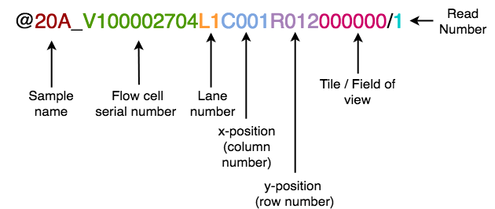

# BGI_vs_Illumina_Benchmark
This repository contains code related to the publication "Comparative performance of the BGI and Illumina sequencing technology for single-cell RNA-sequencing" by Senabouth et al.

## Sample Information
| Sample | Platforms                 | Sample Index | Projected number of cells | Chemistry                                 | Species      | Reference        | Cell Type                                                                          |
|--------|---------------------------|--------------|---------------------------|-------------------------------------------|--------------|------------------|------------------------------------------------------------------------------------|
| iPSC   | NextSeq 500, MGISEQ-2000  | SI-GA-A9     | 10,000                    | 10x Genomics Chromium Single Cell 3' (v2) | Homo sapiens | hg19             | Human induced pluripotent stem cells derived fibroblasts collected from two donors |
| TMWC   | NextSeq 500, MGISEQ-2000  | SI-GA-D4     | 20,000                    | 10x Genomics Chromium Single Cell 3' (v2) | Homo sapiens | GRCh38 + CROPseq | CRISPR screen of hIPSC-derived Trabecular Meshwork Cells                           |
| PBMC1  | NovaSeq 6000, MGISEQ-2000 | SI-GA-F1     | 20,000                    | 10x Genomics Chromium Single Cell 3' (v2) | Homo sapiens | GRCh38           | Peripheral Blood Mononuclear Cells collected from pools of donors                  |
| PBMC2  | NovaSeq 6000, MGISEQ-2000 | SI-GA-F2     | 20,000                    | 10x Genomics Chromium Single Cell 3' (v2) | Homo sapiens | GRCh38           | Peripheral Blood Mononuclear Cells collected from pools of donors                  |

## Data repository
Raw and processed data for both platforms are available via ArrayExpress ().

## Pre-processing
### Illumina datasets
FASTQ files were generated from BCL files using the [10x Genomics Cell Ranger version 2.2.0](https://support.10xgenomics.com/single-cell-gene-expression/software/pipelines/2.2/what-is-cell-ranger) *mkfastq* pipeline.

### BGI datasets
FASTQ files were generated from raw base calls using the Zebra Call software by BGI.

### Software Environment
The software environment required to run all stages of this study can be loaded in conda with the [environment.yml](config/environment.yml) file.

### Preparing data downloaded from ArrayExpress
Sequence from all sequencers were run in 4 sequencing lanes. For data generated by the MGISEQ-2000, reads are divided into an additional four files for each set of reads. These reads originally were originally associated with each sample index nucleotide sequence.

Data for each set of reads, from all lanes were combined into a single FASTQ file for submission to ArrayExpress. The script [splitFastqs.sh](preprocessing/separateFastqs.sh) can be used to split the files back into individual files for each lane. The reads from each lane must be separated for processing by the Cell Ranger v2.2.0 pipeline.

The script can be invoked as follows:

```bash
# Example: Illumina FASTQ file
bash separateFastqs.sh BGIvsIllumina_iPSC_Illumina_S1_I1_001.fastq.gz

# Example: BGI FASTQ file
bash separateFastqs.sh BGIvsIllumina_iPSC_BGI_S1_R1_001.fastq.gz
```

### Conversion of BGI-sequenced headers to Illumina-compatible headers
The Cell Ranger pipeline requires FASTQ headers to be in an Illumina-compatible format. BGI headers are formatted differently, as described by the diagram below:



As sample indices weren't used for BGI sequencing, we added sample index barcodes to the BGI headers using [attachBarcodes.sh](preprocessing/attachBarcodes.sh). This is required for processing by the Cell Ranger pipeline.

Headers from BGI files can be converted with the included Python script [convertHeaders.py](preprocessing/convertHeaders.py).

Usage:
```bash
python convertHeaders.py -i $INPUT_BGI_FASTQ -o $OUTPUT_BGI_FASTQ
```

Please note that it takes a day or two to reformat headers from an entire BGI flowcell. This will split the BGI file into four sets of files, one for each lane.

### scRNA-seq Analysis


